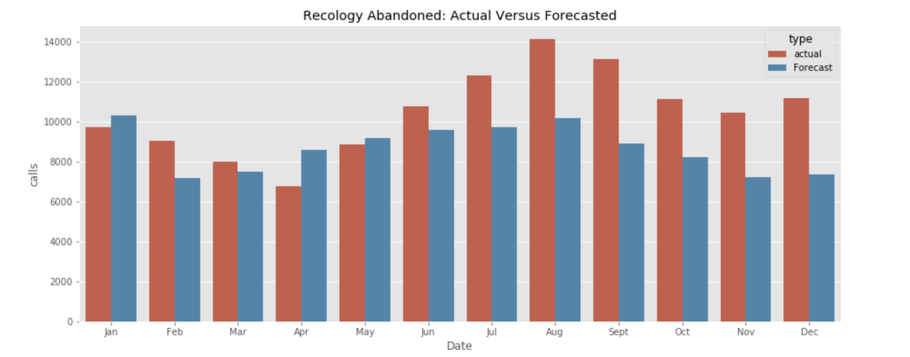

# San_Francisco_311_Project

[Presentation Folder](https://drive.google.com/drive/folders/1LtgYiXuhT6gyV6Nqd6ib5lF-xbo1qlFC?usp=sharing)

[Blog Post](https://solerjaklyn.medium.com/effect-of-covid-19-on-sf-311-calls-17ef010e5fb2)

[Connect with me on LinkedIn](https://www.linkedin.com/in/jaklyn-soler-6a298965/)

### Strategic Approach

The objective is to forecast the quantity of future calls by the specific agency or queue to determine if there is a change in human resources needed in advance for the top 20% of most common agencies requested during 2020 of the COVID-19 pandemic. 
By sorting through over 3 million rows of data, I will identify what agencies are being underutilized due to less calls during the pandemic and which agencies are experiencing a higher number of calls.

### Notebook Layout

You will be able to find the following agency queue analysis in the following notebooks.

- **PART ONE:** DPW Ops Queue, Recology Abandoned, Parking Enforcement
- **PART TWO:** Abandoned Vehicles, BSM Queue, HSOC Queue, Recology Overflowing
- **PART THREE:** Supervisor Queue, Duplicate Queue, MUNI Work Queue, PUC Sewer Ops, Meter Bike Queue
- **PART FOUR:** Channel Transit, Homeless Concerns, Postal Service, BSSR Queue
- **PART FIVE:** Parking Enforcement Review, DPT SignShop Queu, Streetlights Queue, Water Queue
- **CONCLUSION:** Asking relevant questions and analysis of findings 

### Data Used

The [data](https://data.sfgov.org/City-Infrastructure/311-Cases/vw6y-z8j6) is available online from the SF local government. During this project I worked with over 3 million rows of data. 

### Building a Strategy

Due to the pandemic, I couldn't use the recent time series data from the 311 calls as it would not be consistent. Instead I decided that I could compare what the forecast for 2020 would be if we were predicting it, versus what actually happen. My goal was to offer suggestions for the forecasted need of human capital. 

### Narrowing the Dataset

I cut all of the data after 2020 and forecasted the time series to determine what the hypothetical demand for 311 agencies would be. For the majority of the project I only used the agency responsible and the date.

### Modeling + Results

After findind the most in-demand agencies with the highest number of calls, I started modeling the top 20. I found out that 9 of those 20 did not have enough data to forecast since they were new call queues. After modeling I compared the forecasted versus actual 311 calls and saved them in a dataframe.

### Most in Demand During a Pandemic?

The calls that were in the most demand and not accounted for with forecasting was for the recology queue.

### Findings

In this bar graph, the values reflect calls that were forecasted minus calls that actually happened. The negative bars are the calls that happened. You can see recology is the largest negative bar. It shows that there is a significant increase in the number of calls that not only broke even with the forecasted amount but went far past it.
In the top left portion of the graph, the bars have not been affected by actual calls which means that due to the pandemic there were not as many people calling DPW operations or filing complaints about abandoned vehicles.

### Recommendation

In light of this situation, my recommendation for the SF government would be for them to reallocate their human resources. They have a surplus of people that would have been tending to abandoned vehicle requests and DPW operations requests, but those requests are no longer happening. Since there is an unexpectedly high amount of calls about recology, my recommendation would be that the employees previously in other roles, temporarily help with the trash. This would prevent the employees from being fired from their jobs and it would prevent the SF local government from having to hire new employees.

### Future Work

I used a range of 0 to 3 on the p, d, and q parameters for SARIMAX modeling. This range could be expanded to find better models. For the queues that have been around for less than 5 years, it may be possible to find a spot where they were part of another queue before being divided. Having this information might allow me to piecemail more of the call history together for unknown queues. 